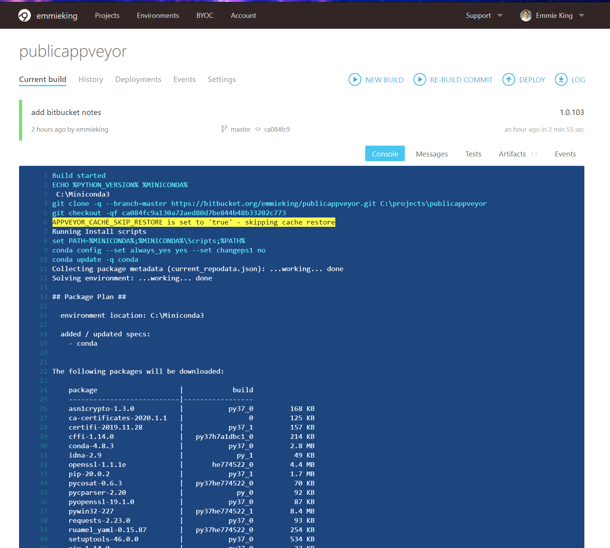

Welcome to SEE's Setting up AppVeyor Continuous Integration documentation!
==========================================================================

==========================
1. Setup AppVeyor Account
==========================

`AppyVeyor link: <https://ci.appveyor.com/signup>`_ choose the **FREE - for open-source projects** plan.

=======================
2. Link with BitBucket
=======================

Select ``+ New Projects`` 

Select ``Bitbucket`` on the left sidebar.

Authorize AppVeyor as OAuth 2.0 app so it can act on behalf of 
<your account name> Bitbucket account with account, team, 
repository, pullrequest, webhook permissions.

Find the repository in your repo list and click ``+ Add``.

Make sure that your ``appveyor.yml`` is in the root of your repository.

=======================
3. Check Current Build 
=======================

Select ``Projects`` 

Select the project that you added, e.g. ``PublicAppVeyor``

Select ''Current Build`` to see the AppVeyor console.

Green = Passed

Red = Failed

Yellow = In Progress

