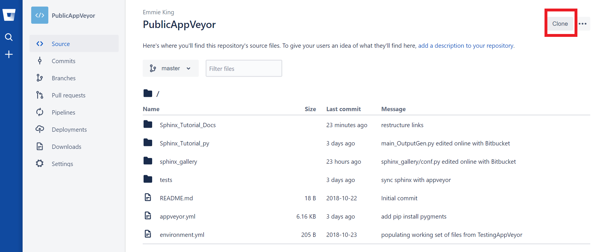

Welcome to SEE's Setting up BitBucket Repo documentation!
=========================================================

===============
1. Install Git
===============

This tutorial will be using the Windows `git command line tool <https://www.atlassian.com/git/tutorials/install-git>`_.

=========================
2. Open a Command Prompt
=========================

Run the following commands to configure your Git username and email.

**$** ``git config --global user.name "EmmieKing"``    [BitBucket UserName]

**$** ``git config --global user.email "Emmie@SEE.com"``     [Bitbucket Email]

=========================
3. Clone your repository
=========================

Log into your SEE `Bitbucket <https://id.atlassian.com/login>`_ account.
Find the repository that you want to work with and clone it to your local
machine. I used the HTTPS protocol: 
**$** ``git clone https://emmieking@bitbucket.org/emmieking/publicappveyor.git``

=======================
4. Common Git Commands
=======================

Add your changes to the BitBucket remote repository:

**$** ``git add <name of file>`` OR ``git add .`` [. = all files that have been changed]

**$** ``git commit -m "Comments about what has changed``

**$** ``git push``

Update your local files from the BitBucket remote repository:

**$** ``git pull``